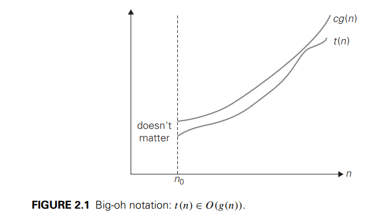
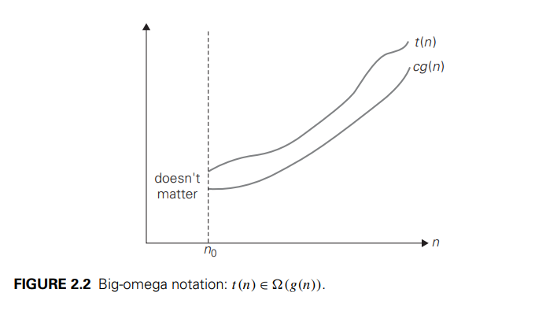
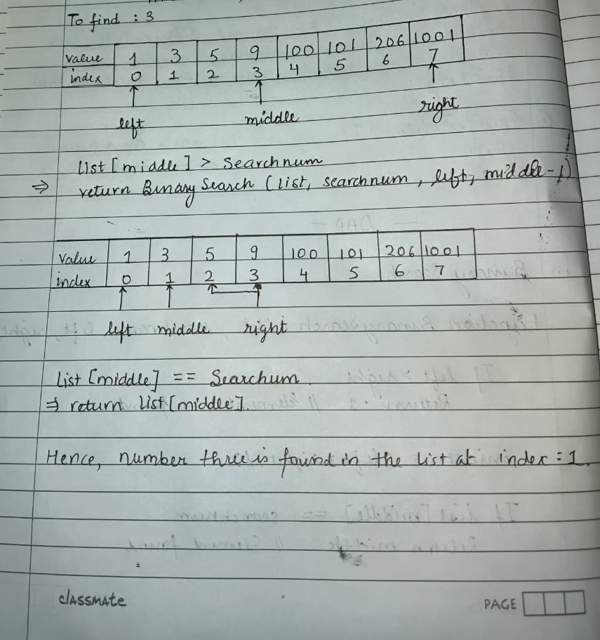
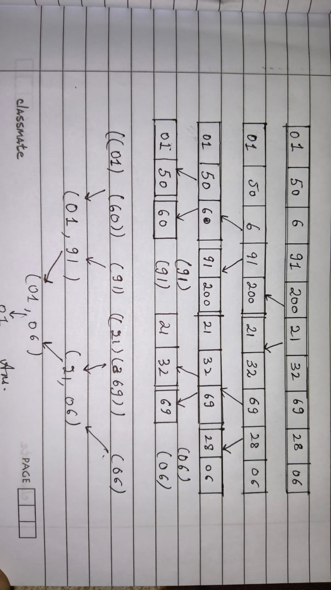
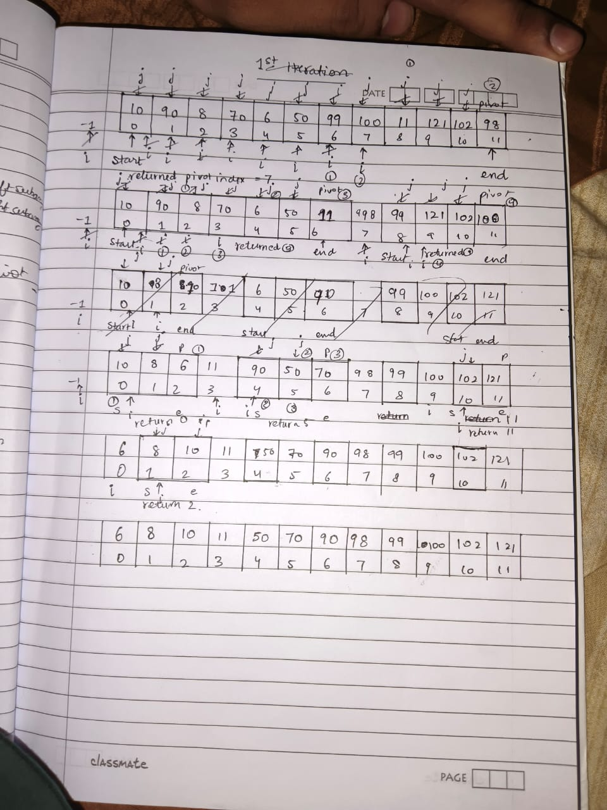

# Design and Analysis of Algorithm notes
## Concept of Algorithm
* An algorithm is a set of rules for carrying out calculation either by hands or a machine.
* An algorithm is aa set of computational steps that transform the input into the output.
* An algorithm is the process of alocating data into data structures.
* A finite set of instructiions which are used to solve a specific problem when run in an order is called an algorithm.
* An algorithm is an abstraction of a program to be run on a machine.
* An algorithm is a set of steps performed to solve a poroblem.
* It can be defined as a sequence of definite and effective instructions, while terminates with the production of correct output from the given input.

## Characteristics of algorithm
Every algorithm should follow the following chatracteristics:
### Input
* An algorithm should have zero or more inputs.
* The inputs are taken from a specified set of subjects.

### Output
* An algorithm may have one or more outputs.
* Output is a quantity which has a specified relation with the input.

### Finiteness
* An algorithm must terminate after a countable number of steps.
* In some cases the repetition number may be larger.
* If a procedure is able to resolve in a finite number if steps, it is called a computational method.

### Definiteness
* An algorithm should have precisely defined steps.
* Every step of your algorithm should be **crystal clear**, not vague.
* No “do it somehow” type of instructions.
* A computer (or even a human following blindly) should be able to understand exactly what to do.
* If natural language sounds confusing, you can write steps using **math symbols or pseudo-code**, so it’s unambiguous like programming code.

### Effectiveness
* An algorithm is generally expected to effective.
* Means the steps should be sufficiently basic, so that it may be possible for a man to resolve them.

### Algorithm Specification Template

1. **Problem Definition:**
   State what the algorithm is supposed to do.

2. **Input:**
   Clearly mention what kind of data the algorithm will take.

3. **Output:**
   What result the algorithm should produce.

4. **Steps (Procedure):**
   Numbered list of precise steps (in plain English, pseudocode, or both).

***

### **Example: Binary Search**

1. **Problem Definition:**
   To find the position of a given element (key) in a sorted list using Binary Search.

2. **Input:**

   * A sorted array `A[1..n]` of `n` elements
   * A key element `x`

3. **Output:**

   * Index `i` such that `A[i] = x`, if present
   * Otherwise, report “Not Found”

4. **Steps:**

   1. Set `low = 1`, `high = n`.

   2. While `low ≤ high`:
      a. Set `mid = (low + high) / 2`.
      b. If `A[mid] = x`, return `mid`.
      c. If `A[mid] > x`, set `high = mid – 1`.
      d. Else, set `low = mid + 1`.

   3. Return “Not Found”.
  
   ***

## Performance Analysis

There are many criteria upon which we may judge a program:

* Does the program meet the original specifications of the task?
* Does it work correctly?
* Does the program contain documentation about its use?
* Is the program's code readable?
* Is the program's code modular

However we could judge the program's performace using a more concrete criteria:

* Does the program efficiently use primary and secondary memory?
* Is the program's running time acceptable for the task?

### Space Complexity
The _space complexity_ refer to the amount of memory a function needs to run to completion
* The space needed by programs is a sum of following components:

- **Fixed Space Requirements:** This component refers to the space requirements that do not depend on the size of the program's inputs and outputs.The fixed requirements include the instruction space, space for simple variables, fixed size structured variables, and constants.
  
- **Variable Space Requirements:** : This component consists of the space needed by structured variables whose size depends on the particular instance, _I_, of the problem being solved. It also includes the additional space required when a function uses recursion. The variable space requirement of a program _P_ working on an instance _I_ is denoted `Sp(I)`.

We can express the total space requirement S (P) of any program as:
$$S(P) = c + Sp(I)$$
where $c$ is a constant representing the fixed space requirements.

* When analyzing the space complexity of a program we are usually concerned with only the variable space requirements.
* This is particularly true when we want to compare the space complexity of several programs.

### Time Complexity
The time complexity of a program is the amount of computer time that it needs to run to completion.

* The total time taken by a program `P` is:
  **Tₚ = Compile Time + Run Time (Execution Time)**

#### 1. Compile Time

* Similar to **fixed space component** → does not depend on input/instance.
* Once program correctness is verified, we may run it many times **without recompiling**.
* So, compile time is usually ignored in performance analysis.

#### 2. Execution Time (Run Time)

* The main concern in algorithm analysis.
* Depends on:
  * The **compiler** (how source code is translated to machine code).
  * The **operations performed** in the program.

Example:
For input size `n`,

$$
Tₚ(n) = c₁·ADD(n) + c₂·SUB(n) + c₃·LDA(n) + c₄·STA(n)
$$

where:

* `ADD(n)`, `SUB(n)`, `LDA(n)`, `STA(n)` → number of additions, subtractions, loads, stores.
* `c₁, c₂, c₃, c₄` → constant time taken per operation.

#### 3. Practical Difficulty

* Getting exact `Tₚ` is **hard** (requires deep compiler-level knowledge).

#### 4. Approaches to Estimate Run Time

1. **Use system clock** → run the program and measure execution time.
2. **Operation counting** → count number of basic steps/operations.

   * Machine-independent estimate.
   * Requires deciding what counts as a “step.”

## Asymptotic Notations (O, Ω, Θ)
* Exact step counts of programs are hard to determine and are often unnecessary.
* Step counts are unexact: one step could be `x = y` or `x = y + z - x/z` etc.
* The goal is to compare the growth rates as the input size of algorithm `n` increases.
* For large n, knowing approximate growth is enough to predict which program runs faster.
* The **break-even point** `k` is the input size `n` after which one algorithm consistently outperforms another; knowing the exact constants is usually not needed.

### 1. The Big - Oh Notation $(O)$ - _Upper Bound, Worst Case_
$$
f(n) \in O(g(n)) \text{ if there exist constants } c > 0 \text{ and } n_0 \text{ such that } f(n) \le c \cdot g(n) \text{ for all } n \ge n_0.
$$
* Algorithm will take at most O(g(n)) time for large n.
Common types:

$O(1)$ → constant
$O(log n)$ → logarithmic
$O(n)$ → linear
$O(n log n)$ → log-linear
$O(n²)$ → quadratic
$O(n³)$ → cubic
$O(2ⁿ)$ → exponential



### 2. Omega Notation $(Ω)$ – _Lower Bound / Best Case_

$f(n)∈Ω(g(n)) \text{ if there exist constants } c>0,n_0​ \text{ such that } f(n)≥c⋅g(n) \text{ for all } n≥n_0​$

* Algorithm will take **at least** $Ω(g(n))$ time for large `n`.

  

### 3. Theta Notation (Θ) – _Tight Bound / Average Case_

$f(n)∈Θ(g(n)) \text{ if there exist constants } c1​,c2​>0,n_0​ \text{ such that } c1​⋅g(n)≤f(n)≤c2​⋅g(n) \text{ for all } n≥n_0​$

Meaning:

* Algorithm grows **exactly like g(n)** for large `n`.
* More precise than $O$ or $Ω$ because it gives **both upper and lower bounds**.


***

## Divide and Conquer
* In this approaach we solve a problem recursively by applying three steps:
- **Divide**: Break the problem into several sub-problems of smaller size.
- **Conquer**: Solve the problem recursively.
- **Merge**: Combine the solution based on a condition to create a solution to the original problem.

### General Algorithm:
```dart
Algorithm DC(p)
{
	if small(p)
    then return S(P)
    else
    {
    	divide p into smaller instances P1, P2, P3, ... Pn.
        Apply DC to each sub - problem
        Return DC(P1) + DC(P2) + DC(P3) + ... + DC(Pn) where + is an operator.
    }
}
```

Let a recurrence relation is expressed as 
$$T(n)= ϴ(1), \text{ if } n<=C \text{ aT } (n/b) + D(n)+ C(n)$$ where n = input size, a = no. Of sub-problems, b= input size of the subproblems.

#### Binary Search
```dart

Function BinarySearch(list, searchnum, left, right):
	if left > right:
        return -1 //Element not found
	
    middle = (left + right)/2

    if list[middle] == searchnum:
		return middle  //Element found

    else if list[middle] > searchnum:
		return BinarySearch(list, searchnum, left, middle - 1) //Search the left half
    else 
        return BinarySearch(list, searchnum, middle + 1, right) //Search the right half

```

**Time Complexity:** $O(logn)$
**Recurrence:** $T(n) = T(n/2) + O(1)$
**Work per level:** $O(1)$ (dividing and selecting one part from the two)
**Number of levels:** $log_2n$ 
**Total Work:** $O(1) * logn = O(logn)$

Example:



#### Finding max or min 
##### Min:

```dart

Function FindMin(arr, low, high):
	if low == high: //one element only
		return arr[low]

    if high = low + 1: //if only 2 elements
		return min(arr[low], arr[high])

    mid = (low + high) / 2

    min1 = FindMin(arr, low, mid)
    min2 = FindMin(arr, mid + 1, high)

    overall_min = min(min1, min2)

    return overall_min
            
```
**Complexity:** $O(n)$
**Recurrence:** $T(n) = 2T(n/2) + O(1)$
**Work per level:** $O(2^k)$ (dividing into two parts each step)
**Number of levels:** $log_2n$ 
**Total Work:** Sum across all levels:
$T(n) = \sum_{k=0}^{\log_2 n} W_k = \sum_{k=0}^{\log_2 n} O(2^k)$

This is a **geometric series**:
$1+2+4+⋯+n=2n−1≈O(n)$



#### Quick Sort`

```dart
QUICKSORT (array, start, end):
	if start < end:
		pivotIndex = PARTITION(array, start, end)
        QUICKSORT(array, start, pivotIndex - 1) // sort left subarray
        QUICKSORT(array, pivotIndex + 1, end) // sort right subarray

PARTITION (array, start, end):
	pivot = array[end] // choose last element as pivot
    i = start - 1
    for j = start to end - 1:
		if array[j] < pivot:
			i = i + 1
            swap array[i] <-> array[j]
    swap array[i+1] <-> array[end] // place pivot at right place
    return i + 1 // pivot index
```

QuickSort is a **divide-and-conquer algorithm**.
* **Divide:** Pick a pivot (here, the last element) and partition the array into two subarrays:
  * Left subarray: all elements ≤ pivot
  * Right subarray: all elements ≥ pivot
* **Conquer:** Recursively sort the left and right subarrays.
* **Combine:** Nothing to do — arrays are sorted **in-place**.

##### **Partition Function**

* Picks the **last element as pivot**.
* Moves all elements ≤ pivot to the left, others to the right.
* Returns pivot’s final position `q`.
* Work done = **Θ(n)** for a subarray of size n (each element compared once).

##### Recurrence Relations

Let’s define **$T(n) = \text{time to sort n elements}$**.

##### Worst Case

* Happens when **pivot is the smallest or largest element** → completely unbalanced split:
  * One subarray = size $n−1$
  * Other subarray = size 0
$$T(n)=T(n−1)+T(0)+Θ(n)=T(n−1)+Θ(n)$$
* Solve it:
$$T(n)=n+(n−1)+(n−2)+…+1=O(n2)$$
> Intuition: Each partition scans the whole array, but only reduces size by 1 → quadratic behavior.

***

##### Best Case

* Pivot splits array **exactly in half** every time:
  * Subarrays = $n/2$ and $n/2$
  
$$T(n)=2T(n/2)+Θ(n)$$

* Solve with Master Theorem / recursion tree:
$$T(n)=O(nlogn)$$
> Intuition: Work per level = Θ(n), number of levels = log₂ n → total = n log n

***

##### Average / Balanced Case

* Pivot splits array roughly **constant ratio**, e.g., 9:1:

$$T(n)=T(9n/10)+T(n/10)+Θ(n)$$

* Recursion tree depth = $O(log n)$ (because each time array reduces by constant fraction)
* Work per level = $Θ(n)$
* **Total work = $O(n log n)$**

> Key insight: The exact split ratio changes the constants but **not the asymptotic complexity**.
> 


##### Selection of Pivot Element in QuickSort

The pivot element is the value around which the array is partitioned. The choice of pivot significantly affects QuickSort’s performance.

1️. **Role of Pivot**

Partition the array into two subarrays:
_Left subarray_: all elements ≤ pivot
_Right subarray_: all elements ≥ pivot

Recursive sorting of these subarrays eventually sorts the whole array.

2️. **Common Methods to Choose Pivot**

* First element of the array
> Simple, but can be bad for already sorted arrays → worst-case O(n²)

* Last element of the array

> Used in Lomuto partition
> Same risk as above

* Random element

> Pick a random index as pivot
> Reduces chance of worst-case performance
> Gives expected O(n log n) running time

* Median-of-three

> Pick first, middle, last elements and take their median
> Improves balance of partitions
> Often used in practical implementations

* True median

> Guarantees perfectly balanced split
> Expensive to compute → rarely used in practice

* Effect on Complexity

| Pivot Choice    | Best Case  | Worst Case          | Expected Case |
| --------------- | ---------- | ------------------- | ------------- |
| First / Last    | O(n log n) | O(n²)               | O(n log n)    |
| Random          | O(n log n) | very unlikely O(n²) | O(n log n)    |
| Median-of-three | O(n log n) | O(n²)               | O(n log n)    |
| True Median     | O(n log n) | O(n log n)          | O(n log n)    |

> Key idea: The closer the pivot is to the true median, the more balanced the partitions → faster sorting.

***

## Greedy Algorithms 

### Introduction

The **Greedy method** is a strategy for solving _optimization_ problems.
An optimization problem requires finding the best solution (maximum or minimum) that satisfies a set of constraints.

Greedy algorithms build the solution step by step.
At each step, they select the option that looks **best at the moment** (locally optimal choice).
Once a choice is made, it is **never changed later**.

***

### Feasible vs. Optimal Solution

* A solution is **feasible** if it satisfies all constraints of the problem.
* Among feasible solutions, the one that optimizes the objective function (maximum or minimum) is called the **optimal solution**.

***

### **Characteristics of Greedy Approach**

1. **Feasibility** – Every step must satisfy explicit and implicit constraints.

   * _Explicit constraints:_ Output must use only elements from the input set.
   * _Implicit constraints:_ Must satisfy the problem’s objective function.

2. **Locally Optimal Choice** – At each step, the algorithm selects the best candidate available without considering future consequences.

3. **Irrevocability (Unalterable)** – Once a decision is taken, it cannot be undone.

4. **Greedy-Choice Property** – A global optimum can be reached by choosing local optima at each step.

5. **Optimal Substructure** – An optimal solution to the overall problem contains optimal solutions to its subproblems.

***

### **General Strategy of a Greedy Algorithm**
`isfit`

1. **Initialization** – Start with an empty solution set.
2. **Selection** – At each step, choose the best candidate according to a selection criterion.
3. **Feasibility Check** – If adding the candidate keeps the solution feasible, include it.
4. **Irrevocability** – Do not reconsider discarded candidates.
5. **Termination** – Repeat until the solution is complete or no more candidates remain.

```dart
Greedy(A, n)
{
    solution = ∅

    for i = 1 to n do
    {
        x = Select(A)              // choose the best candidate
        if Feasible(x) then        // check if adding x is valid
            solution = solution ∪ {x}
    }

    return solution
}

```

* `Select(A)` → picks the _locally best_ candidate according to some greedy strategy.
* `Feasible(x)` → checks whether adding this choice keeps the solution valid (no violation of constraints).
* `solution` → keeps building the final answer step by step.
* The loop → goes over the set of candidates, trying to construct the solution.

***

### **Advantages**

* Simple to design and implement.
* Efficient in terms of time complexity (often **O(n log n)** due to sorting).
* Works well when the greedy-choice property holds.

***

### **Disadvantages**

* Does not always guarantee an optimal solution.
* Can fail when local decisions don’t lead to a global optimum.
* Needs mathematical proof to confirm correctness.

***

### **Applications**

* Scheduling problems
* Minimum spanning trees (Prim’s, Kruskal’s algorithms)
* Huffman coding
* Graph coloring, shortest paths (Dijkstra’s)

***

 So, in essence:
The **Greedy method** is a problem-solving paradigm where we repeatedly make the **locally optimal choice** with the hope of reaching the **globally optimal solution**.


