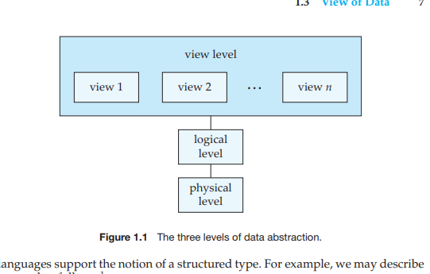

# Relational Database Management Systems

## Database:
#syllabus-database
#syllabus-database-management-system-dbms  

* A **database** is a collection of some interrelated data stored in an organized form.
* A **DBMS** is a software used to store a collection of some interrelated data and a set of programs used to retrieve the data efficiently and conveniently. It is _query based_.
* An **FBMS** is a traditional way of storing the data in a file container and retrieve it via complex programs. File read/write operations are performed rapidly.

#syllabus-advantages-and-disadvantages-of-dbms
### Redundancy
* Also refers to duplicacy of data.
* Data stored in FBMS is in an inconsistent format
* Multiple files have similar lines of data
* If the field changes in one file, one has to change it manually everywhere else.
* This is absent in DBMS.

### Efficiency in Accessing data
* In FBMS, data is manually or fetched with help of a custom program.
* Data retrieval in FBMS is a tedious task.
* In DBMS, however, the query - based retrieval makes it really easier and smooth to retrieve data.

### Atomicity of data
* It refers to the property of a DBMS by virtue of which
- while reading data, one can't write the data to same field
- while writing data, one can't read from the same field
* **Either do something in entirety or don't do it**
* In FBMS, there is no atomicity by default which leads to system failure.
* In DBMS, we have atomicity and the DBMS manages such issues by **undo, redo**.

### Integrity
* It means how the components of any management system are tied together as a whole.
* It includes the schemas, constraints and consistency in the database.
* It is by default absent in FBMS
* It is available in DBMS in form of schemas and constraints.

### Parallelism
* According to proces synchronisation, at a time data field can't be operated by two processes.
* Absent in FBMS, present in DBMS.

### Disadvantages of DBMS
* Not cost effectiv e for smaller businesses, which can rely on FBMS for fewer cost.
* Needs training before use, an expertise in sql or a similar language is required/.
* Consumes more resources, including storage bandwisth and security resources.
## The Three Level Model
#syllabus-three-level-ansi-sparc-architecture
 

According to the Database Approach by ANSI SPARC:
* A DBMS should have multiple views
* A DBMS should have clear separation of data from programs (program-data independence)
* A DBMS should have a catalogue so as to make it self defining (schema)

To implement all of these points, the three level schema architecture was proposed.

### The Physical Level (internal):
* It tells us **How The data are stored**.
* It **defines internal storage structures**.
 associated with the storage which are complex and low-level such as buffer, space, transactions, atomics etc.
* The **physical schema** describes the database design at the physical level

### The Logical Level (conceptual):
* It tells us **What data are stored** and **Which relationships exist among them**
* It uses _relatively simple_ data structures but it might be using _much more complex_ data structures at the physical level.
* It needs not to be aware of the complexity (because it is a higher layer of abstraction).
* This independent behaviour is known as **physical data independence**.
* DBAs and database designers typically define the **logical schema** (tables, constraints, relationships

### The View Level (external):
* Users don't need to access the entire information inside a DBMS at a given time; they only require to _view_ a part of it.
* Even though the logical level uses simpler data structures, complexity remains since many kinds of relationships and data are stored.
* The view level is the **highest level of abstraction** in the three level architecture.
* It describes only a **part of the entire database**.
* Used by the application users.
* The system may provide many views for the same database corresponding to the users.
* This provides **logical data independence** → meaning the view remains unaffected even if the logical schema changes (as long as relevant data is preserved).
* A database may also have several schemas at the view level, sometimes called **subschemas**, that describe different views of the database.

## Database Administrator
#syllabus-dba #syllabus-responsibilities-of-dba
* One of the main reasons for using DBMSs is to have central control of both the data and the programs that access those data.
* A person who has such central control over the system is called a database administrator (DBA). The functions of a DBA include:
  - **Schema definition** The DBA creates the original database schema by executing a set of data definition statements in the DDL.
  - **Storage structure and access-method definition**
  - **Schema and physical-organization modification** The DBA carries out changes to the schema and physical organization to reflect the changing needs of the organization, or to alter the physical organization to improve performance.
  - **Granting of authorization for data access** By granting different types of authorization, the database administrator can regulate which parts of the database various users can access. The authorization information is kept in a special system structure that the database system consults whenever someone attempts to access the data in the system.
  - **Routine maintenance**. Examples of the database administrator’s routine maintenance activities are:
     * Periodically backing up the database, either onto tapes or onto remote servers, to prevent loss of data in case of disasters such as flooding.
     * Ensuring that enough free disk space is available for normal operations, and upgrading disk space as required.
     * Monitoring jobs running on the database and ensuring that performance is not degraded by very expensive tasks submitted by some users

## Instances and Schemas
* The collection of information stored in the database at a particular moment is called an **instance** of the database. 
* The overall design of the database is called the database **schema**.
- Database systems have several schemas, partitioned according to the levels of abstraction.
- The _physical schema_ describes the database design at the **physical level**.
- The _logical schema_ describes the database design at the **logical level**.
- A database may also have several schemas at the **view level**, sometimes called _subschemas_, that describe different _views_ of the database.

  